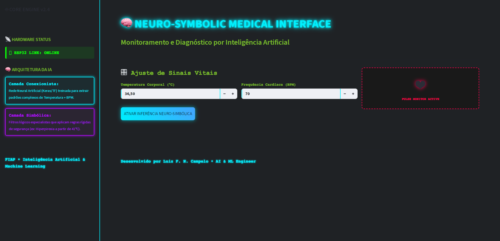
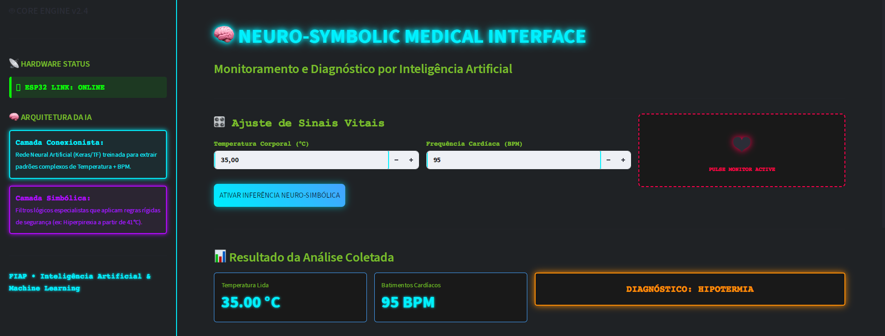
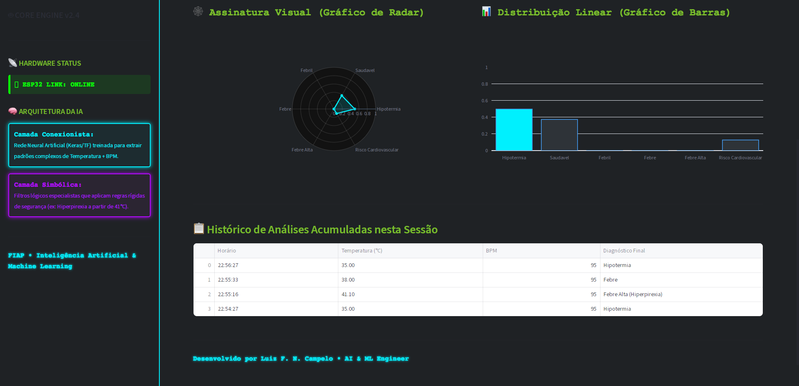

# FIAP - Faculdade de Informática e Administração Paulista

<p align="center">
  <a href="https://www.fiap.com.br/">
    
  </a>
</p>

<br>

---
# 🧠 IA Neuro-Simbólica para Classificação Clínica (Temperatura + Frequência Cardíaca)


## Integrantes: 
<p align="left">
  <a href="https://github.com/Luiz-Frederico" target="_blank">
    
  </a>

  ## Professores:
### Coordenador(a) / Tutor(a) 
<p align="left">
  <a href="https://github.com/agodoi" target="_blank">
    
  </a>
  <a href="https://github.com/SabrinaOtoni" target="_blank">
    
    </a>
  </p>

 ## 📌 Descrição do Projeto

Este projeto consiste em um ecossistema de ponta a ponta voltado para a área da saúde, integrando hardware (simulado), modelos preditivos e interfaces de usuário por meio de uma arquitetura de microsserviços desacoplada. O sistema implementa uma abordagem de **Inteligência Artificial Neuro-Simbólica** para a classificação de riscos clínicos em pacientes com base em dois sinais vitais primários: **Temperatura Corporal** e **Frequência Cardíaca (BPM)**.

A arquitetura do projeto foi desenhada seguindo padrões modernos da Engenharia de Machine Learning (MLE), dividindo o ciclo de vida da aplicação em camadas independentes de captação de dados, serviço de inferência distribuído em nuvem e interface rica de monitoramento.

### O Paradigma Neuro-Simbólico em Cenários Críticos
Sistemas puramente estatísticos (como redes neurais profundas) são excelentes para mapear padrões não lineares complexos, mas estão sujeitos a incertezas e "alucinações" em regiões de fronteira. Em domínios de alta criticidade — como o diagnóstico médico ou a aviação —, falhas estatísticas são inaceitáveis.

Este sistema resolve essa limitação acoplando:
1. **Camada Conexionista (Rede Neural):** Uma rede Multilayer Perceptron (MLP) que processa e calcula as distribuições de probabilidade estatística contínua para os sintomas do paciente.
2. **Camada Simbólica (Filtro Especialista):** Um conjunto determinístico de regras rígidas baseadas em conhecimento clínico consolidado que atua como um *fail-safe* intransponível. Caso o paciente atinja uma zona de risco absoluto (ex: Hiperpirexia ou Hipotermia estrita), a lógica simbólica sobrescreve a predição da rede, garantindo que o diagnóstico permaneça logicamente consistente e seguro.

A proposta é ilustrar como uma rede neural pode ser combinada com regras simbólicas, uma abordagem valiosa em áreas como diagnósticos médicos e veículos autônomos.

Embora o problema clínico tratado aqui pudesse ser resolvido com regras condicionais simples – o que, de fato, é feito no filtro simbólico –, este projeto vai além. Ele foi concebido como um ambiente controlado para explorar, na prática, a construção e o treinamento de redes neurais, bem como a integração dessas com sistemas baseados em conhecimento. O objetivo é compreender, de forma aplicada, o papel da IA neuro-simbólica em cenários onde a confiabilidade e a explicabilidade são tão importantes quanto a acurácia preditiva. Essa abordagem permite simular o comportamento de sistemas críticos, nos quais a combinação de aprendizado estatístico e lógica dedutiva pode reduzir riscos e ampliar a segurança das decisões automatizadas.


## 🚀 Arquitetura e Engenharia do Sistema

O projeto evoluiu de um modelo analítico isolado para uma aplicação distribuída estruturada em três macrocamadas:

* **Camada de Ingestão e Simulação (IoT):** Código desenvolvido em C++ rodando em ambiente microcontrolado (ESP32 via simulador Wokwi). O firmware realiza a leitura analógica de potenciômetros (convertida via ADC) para simular sensores médicos reais de pulso e temperatura, transmitindo as amostras via barramento serial.A pipeline de dados extrai  essas amostras e gera dados sintéticos para balanceamento.
* **Camada de Inferência (FastAPI REST Backend):** Serviço desacoplado que expõe o pipeline neuro-simbólico por meio de uma API REST de alta performance. Implementa validações estritas de tipo e intervalo de dados usando `Pydantic` e fornece isolamento completo para o runtime do TensorFlow.
* **Testes automatizados** – uma célula no notebook valida 11 casos críticos antes da interação com o usuário, assegurando que o filtro simbólico se comporta conforme o esperado.
* **Camada de Visualização (Streamlit Frontend):** Dashboard interativo otimizado para operações de monitoramento clínico em tempo real. A interface gerencia o estado da sessão local, consome a API de forma assíncrona com tratamento resiliente de timeouts e exibe a assinatura de probabilidades do modelo via gráficos dinâmicos do `Plotly`.


## 📊 Engenharia de Dados e Treinamento

O dataset utilizado para o desenvolvimento da camada conexionista é composto por **8.730 amostras**, integrando dados coletados via monitor serial a dados sintéticos estrategicamente gerados para povoar e enriquecer regiões de transição clínica e garantir a estabilidade estatística das classes.

O modelo foi configurado para discernir entre 6 perfis clínicos distintos:

| Classe | Descrição               | Amostras |
|--------|-------------------------|----------|
| 0      | Hipotermia              | 1.575    |
| 1      | Saudável                | 1.505    |
| 2      | Febril                  | 1.590    |
| 3      | Febre                   | 1.480    |
| 4      | Febre Alta              | 1.475    |
| 5      | Risco Cardiovascular    | 1.105    |

> O conjunto é razoavelmente balanceado, com destaque para a classe `Risco Cardiovascular`, que apresenta um volume ligeiramente inferior – o que é intencional, pois essa classe corresponde a uma região de fronteira crítica, onde o filtro simbólico atua de forma predominante.
> Outro ponto relevante é que temperaturas acima de 41,1°C são corretamente classificadas como `Febre Alta` (classe 4), com o acréscimo do indicador visual `(Hiperpirexia)`, reforçando a capacidade do sistema de fornecer diagnósticos enriquecidos com informação clínica adicional.


### Pipeline de Modelagem (MLP)
* **Pré-processamento:** Normalização estrita por escala linear no intervalo $[0, 1]$ (arquivos armazenados em `X_data.npy` e `y_labels.npy`), mapeando os limites físicos de segurança operacional ($43^\circ\text{C}$ e $180\text{ BPM}$).
* **Arquitetura da Rede:** Modelo sequencial `Keras` estruturado com uma camada de entrada, três camadas densas ocultas intercaladas ($128 \rightarrow 64 \rightarrow 32$ neurônios com ativação ReLU) e uma camada de saída Softmax de 6 neurônios para predição probabilística multiclasse.
* **Regularização:** Injeção de penalidade de Ridge Regression (Regularização $L_2$ com fator de `0.0001`) em todos os kernels densos para mitigar o risco de overfitting estrutural.
* **Estratégia de Persistência:** Separação rígida de metadados. O repositório armazena puramente os pesos matemáticos calculados (`.weights.h5`), os quais são reinjetados dinamicamente na arquitetura reconstruída em tempo de execução (`src/modelo.py`), evitando a serialização de grafos inteiros e reduzindo o *footprint* de memória em produção.

## 🧪 Padrões de Qualidade e Testes Automatizados

Para certificar que modificações em produção ou atualizações na rede neural não quebrem as garantias lógicas da camada simbólica, o projeto adota um mecanismo automatizado de testes de regressão localizado no ambiente de desenvolvimento.

O script executa **11 casos críticos de fronteira** de forma síncrona (como transições exatas a $35.0^\circ\text{C}$ ou surtos súbitos de BPM dentro da zona térmica estável). O sistema valida o comportamento do filtro médico e bloqueia a disponibilização da aplicação caso as regras determinísticas sejam violadas, mitigando o risco de regressão lógica.


## 🖼️ Demonstração e Visual do Painel

### Simulação do Hardware (WOKWI)


### Interface de Monitoramento Neuro-Simbólico

> 💡 O notebook está disponível neste repositório:  
> [📓 esp32_tensorflow_temp+batcardiaco.ipynb](notebooks/esp32_tensorflow_temp+batcardiaco.ipynb)  

### Monitoramento Clínico em Tempo Real (Streamlit Dashboard)
#### Visão Geral da Interface Médica


#### Telemetria e Assinatura Visual de Probabilidades


#### Histórico Dinâmico de Diagnósticos


*O painel interativo unifica o controle de telemetria médica e exibe a assinatura visual do diagnóstico em gráficos em tempo real.*


## 🗂️ Estrutura do Projeto

A organização de pastas do repositório segue os padrões recomendados de design de software para desacoplamento de serviços e módulos reutilizáveis:

```
projeto-neuro-simbolico-saude/
├── .streamlit/
│   └── config.toml
├── api/
│   ├── init.py
│   └── main.py                     # Backend FastAPI - Endpoints de inferência e saúde
├── arduino/
│   └── sensor_simulator.ino         # Código-fonte em C++ para simulação do ESP32
├── assets/
│   ├── interface-teste.png          # Ativos visuais dos testes no console
│   ├── wokwi-simulacao.png          # Estrutura do circuito IoT e captura de amostras via barramento serial no Wokwi
│   ├── interface-streamlit-1.png    # Ativos visuais do dashboard do Streamlit
│   ├── interface-streamlit-2.png    # Ativos visuais do dashboard do Streamlit
│   └── interface-streamlit-3.png    # Ativos visuais do dashboard do Streamlit
├── dashboard/
│   ├── init.py
│   └── app.py                      # Frontend Streamlit 
├── data/
│   ├── X_data.npy                  # Atributos normalizados (Temperatura, BPM)
│   └── y_labels.npy                # Vetor de rótulos correspondentes
├── models/
│   └── modelo_saude_6classes_pesos.weights.h5 # Pesos neurais otimizados pós-treino
├── notebooks/
│   └── esp32_tensorflow_temp+batcardiaco.ipynb # Sandbox de extração, modelagem e validação
├── src/
│   ├── init.py
│   ├── classificador.py            # Orquestrador do Pipeline Neuro-Simbólico (Filtros)
│   └── modelo.py                   # Inicializador da Rede Keras e injeção de pesos
├── .env.example                    # Modelo para configuração de variáveis de ambiente
├── .gitignore                      # Isolamento de binários e arquivos de sistema
├── .python-version                 # Definição da versão do interpretador local
├── README.md                       # Documentação técnica do ecossistema
├── requirements-api.txt            # Dependências isoladas para o ambiente de backend
└── requirements.txt                # Dependências globais e do ecossistema de dados
```
## 🛠️ Tecnologias e Bibliotecas Utilizadas

* **FastAPI & Pydantic:** Construção da API REST e validação em tempo de execução dos contratos de dados das requisições.
* **Streamlit:** Desenvolvimento ágil da interface do usuário de monitoramento.
* **Plotly Open Source Graphing Libraries:** Renderização de gráficos de radar e barras dinâmicos para visualização das probabilidades preditivas
* **TensorFlow & Keras:** Framework de Deep Learning utilizado no desenho, compilação e treinamento do modelo preditivo.
* **NumPy & Pandas:** Manipulação vetorial e estruturação das matrizes de sinais clínicos.
* **Scikit-Learn:** Divisão metodológica estratificada do dataset para preservação da proporção de classes na validação.
* **Arduino (C++)** – coleta simulada de sensores.
* **Google Colab** – ambiente de desenvolvimento e execução.

## 📈 Resultados
Acurácia global (validação): ~97%. A abordagem híbrida elimina falsos negativos em zonas críticas, como a transição entre Saudável e Risco Cardiovascular.

## 🔧 Instruções de Execução e Acessos Rápidos
📱 **Interface do Usuário (Frontend):** O dashboard de monitoramento clínico está publicado e disponível para testes imediatos diretamente pelo navegador no link: **[Ambiente de Produção - Streamlit Cloud](https://projeto-neuro-simbolico-saude-dy6nsfwtwza4vwmjteufbf.streamlit.app/)**.

⚙️ **Documentação Interativa da API (Backend):** Seguindo as melhores práticas de governança e arquitetura de software, os endpoints de inferência foram totalmente documentados utilizando o padrão OpenAPI. Você pode testar os contratos de dados e realizar requisições de teste diretamente pela interface interativa do Swagger UI em: **[Ambiente de Testes - Swagger Docs](https://classificador-neuro-simbolico-api.onrender.com/docs)**.

## 🔧 Instruções de Execução (Ambiente Local)

### Pré-requisitos
* **Python 3.10** ou superior instalado localmente.
* Conectividade de rede para comunicação entre os microsserviços.


### 1. Clonagem e Configuração do Ambiente Virtual
```bash
# Clonar o repositório institucional
git clone 
cd projeto-neuro-simbolico-saude

# Criar o ambiente virtual isolado (venv)
python -m venv venv

# Ativar o ambiente virtual

# No Linux/macOS:
source venv/bin/activate

# No Windows (Command Prompt):
venv\Scripts\activate.bat
```
[https://github.com/Luiz-Frederico/projeto-neuro-simbolico-saude.git](https://github.com/Luiz-Frederico/projeto-neuro-simbolico-saude.git)

### 2. Instalação das Dependências Requeridas
```bash
# Instalar os pacotes necessários para execução completa do projeto
pip install -r requirements.txt
```
### 3. Execução do Servidor de Inferência (Backend)
```bash
# Iniciar a API localmente via Uvicorn na porta 8000
uvicorn api.main:app --reload --host 0.0.0.0 --port 8000
```
💡 Dica de Desenvolvimento: Com o servidor local ativo, a documentação interativa para testes locais fica disponível em http://localhost:8000/docs . Para testar a API pública de produção agora mesmo sem rodar o código, utilize o link direto no topo deste documento: **[Ambiente de Testes - Swagger Docs](https://classificador-neuro-simbolico-api.onrender.com/docs)**

### 4. Inicialização do Dashboard de Monitoramento (Frontend)
Abra um novo terminal com o ambiente virtual ativo e execute:
```bash
# Disparar a interface web do Streamlit
streamlit run dashboard/app.py
```
---

### 🚀 Próximos Passos de Engenharia (Roadmap do Portfólio)
Com o objetivo de evoluir a maturidade de engenharia da aplicação para aproximá-la das práticas de grandes sistemas de mercado, os seguintes marcos técnicos foram mapeados para implementações futuras:

* **Conteinerização Isolada (Docker):** Desenvolvimento de Dockerfiles multi-stage para a API e o Dashboard, garantindo a reprodutibilidade absoluta das dependências independentemente da infraestrutura de hospedagem.

* **Orquestração com Docker Compose:** Criação de uma receita para subir e interligar automaticamente o container de backend, frontend e instâncias de testes com um único comando.

* **Automação de Testes Unitários:** Migração da célula de testes de regressão do notebook para scripts formais utilizando pytest, integrando validações automáticas de contratos HTTP.

* **Monitoramento de Data Drift:** Implementação de uma camada leve de logging estruturado para armazenar os sinais recebidos em produção e avaliar desvios de distribuição de dados ao longo do tempo.


## 📋 Licença

<p xmlns:cc="http://creativecommons.org/ns#" xmlns:dct="http://purl.org/dc/terms/"><a property="dct:title" rel="cc:attributionURL" href="https://github.com/SabrinaOtoni/TEMPLATE-FIAP-GRAD-ON-IA">MODELO GIT FIAP</a> por <a rel="cc:attributionURL dct:creator" property="cc:attributionName" href="https://fiap.com.br">FIAP</a> está licenciado sobre <a href="http://creativecommons.org/licenses/by/4.0/?ref=chooser-v1" target="_blank" rel="license noopener noreferrer" style="display:inline-block;">Attribution 4.0 International</a>.</p>


