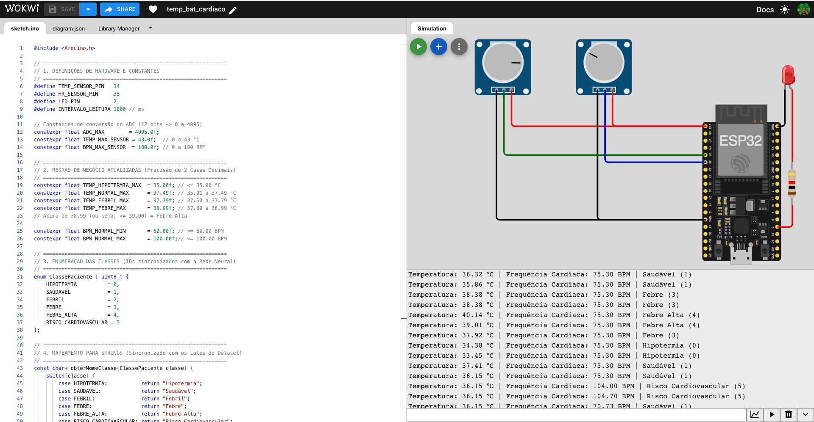
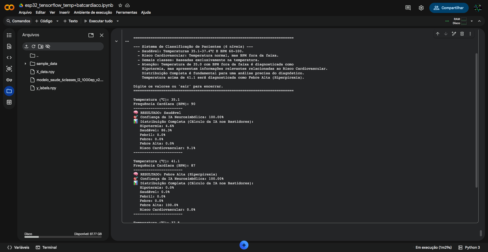

# FIAP - Faculdade de Informática e Administração Paulista

<p align="center">
  <a href="https://www.fiap.com.br/">
    
  </a>
</p>

<br>

---
# 🧠 IA Neuro-Simbólica para Classificação Clínica (Temperatura + Frequência Cardíaca)


## Integrantes: 
<p align="left">
  <a href="https://github.com/Luiz-Frederico" target="_blank">
    
  </a>

  ## Professores:
### Coordenador(a) / Tutor(a) 
<p align="left">
  <a href="https://github.com/agodoi" target="_blank">
    
  </a>
  <a href="https://github.com/SabrinaOtoni" target="_blank">
    
    </a>
  </p>

 ## 📌 Descrição

Este projeto demonstra a integração entre **sensores IoT (simulados)** e um sistema de **Inteligência Artificial neuro-simbólica** para classificação de risco de pacientes com base em temperatura corporal e frequência cardíaca.

A proposta é ilustrar como uma rede neural pode ser combinada com regras simbólicas (baseadas em conhecimento médico) para garantir decisões seguras em regiões críticas, aumentando a confiabilidade do sistema – uma abordagem valiosa em áreas como diagnósticos médicos e veículos autônomos.

Embora o problema clínico tratado aqui pudesse ser resolvido com regras condicionais simples – o que, de fato, é feito no filtro simbólico –, este projeto vai além. Ele foi concebido como um ambiente controlado para explorar, na prática, a construção e o treinamento de redes neurais, bem como a integração dessas com sistemas baseados em conhecimento. O objetivo é compreender, de forma aplicada, o papel da IA neuro-simbólica em cenários onde a confiabilidade e a explicabilidade são tão importantes quanto a acurácia preditiva. Essa abordagem permite simular o comportamento de sistemas críticos, nos quais a combinação de aprendizado estatístico e lógica dedutiva pode reduzir riscos e ampliar a segurança das decisões automatizadas.


## 🚀 Funcionalidades

- **Simulação de sensores** via Arduino (potenciômetros) com conversão ADC.
- **Pipeline de dados** que extrai amostras do monitor serial e gera dados sintéticos para balanceamento.
- **Treinamento de MLP** com regularização L2 e checkpoint para melhor época.
- **Classificador Neuro-simbólico**:
  - Rede neural fornece probabilidades.
  - Filtro simbólico sobrescreve a decisão em zonas de fronteira (ex.: hipotermia estrita, febre alta).
- **Testes automatizados** – uma célula no notebook valida 11 casos críticos antes da interação com o usuário, assegurando que o filtro simbólico se comporta conforme o esperado.
- **Interface interativa** para testes manuais, exibindo distribuição de probabilidades e diagnóstico.

## 📊 Sobre os Dados

O dataset utilizado neste projeto é composto por **8.730 amostras**, resultantes da combinação de leituras reais do monitor serial (simuladas via potenciômetros) e dados sintéticos gerados para enriquecer regiões de fronteira e garantir o balanceamento entre as classes.

A distribuição das 6 classes é a seguinte:

| Classe | Descrição               | Amostras |
|--------|-------------------------|----------|
| 0      | Hipotermia              | 1.575    |
| 1      | Saudável                | 1.505    |
| 2      | Febril                  | 1.590    |
| 3      | Febre                   | 1.480    |
| 4      | Febre Alta              | 1.475    |
| 5      | Risco Cardiovascular    | 1.105    |

> O conjunto é razoavelmente balanceado, com destaque para a classe `Risco Cardiovascular`, que apresenta um volume ligeiramente inferior – o que é intencional, pois essa classe corresponde a uma região de fronteira crítica, onde o filtro simbólico atua de forma predominante.
> Outro ponto relevante é que temperaturas acima de 41,1°C são corretamente classificadas como `Febre Alta` (classe 4), com o acréscimo do indicador visual `(Hiperpirexia)`, reforçando a capacidade do sistema de fornecer diagnósticos enriquecidos com informação clínica adicional.

Os dados foram normalizados no intervalo [0, 1] utilizando os valores máximos esperados (43°C e 180 BPM), e armazenados nos arquivos `X_data.npy` e `y_labels.npy`.

## 🖼️ Demonstração

### Simulação do Arduino (WOKWI)


### Interface interativa de testes


## 🧪 Exemplo de Uso

```python
Entrada: 35.1°C | 90 BPM
-----------------------
🧠 RESULTADO: Saudável
🎯 Confiança da IA Neurosimbólica: 100.00%
📊 Distribuição Completa (Cálculo da IA nos Bastidores):
   Hipotermia: 4.6%
   Saudável: 86.3%
   Febril: 0.0%
   Febre: 0.0%
   Febre Alta: 0.0%
   Risco Cardiovascular: 9.1%
-----------------------

Entrada: 41.1°C | 87 BPM
-----------------------
🧠 RESULTADO: Febre Alta (Hiperpirexia)
🎯 Confiança da IA Neurosimbólica: 100.00%
📊 Distribuição Completa (Cálculo da IA nos Bastidores):
   Hipotermia: 0.0%
   Saudável: 0.0%
   Febril: 0.0%
   Febre: 0.0%
   Febre Alta: 100.0%
   Risco Cardiovascular: 0.0%
-----------------------
```
## 🗂 Estrutura do Projeto
Dentre os arquivos e pastas presentes na raiz deste diretório, definem-se:

```
projeto-neuro-simbolico-saude/
├── arduino/
│   └── sensor_simulator.ino      # Código C++ para simulação dos sensores
├── assets/
    ├── interface-teste.png       # Imagem da interface de teste
    └── wokwi-simulacao.png       # Imagem da simulação e captura das amostras no wokwi
├── data/
│   ├── X_data.npy                # Features (temperatura e BPM)
│   └── y_labels.npy              # Rótulos das classes
├── models/
│   └── modelo_saude_6classes_l2_1000ep_v2.keras  # Modelo treinado
├── notebooks/
│   └── esp32_tensorflow_temp+batcardiaco.ipynb   # Notebook com extração, treino, testes e UI
├── .gitignore
├── README.md
└── requirements.txt
```
## 🛠 Tecnologias Utilizadas
* **TensorFlow / Keras** – construção e treino da MLP.

* **Scikit-learn** – divisão estratificada dos dados.

* **NumPy / Pandas** – manipulação de dados.

* **Arduino (C++)** – coleta simulada de sensores.

* **Google Colab** – ambiente de desenvolvimento e execução.


## 🧠 Abordagem Neuro-Simbólica
A rede neural é treinada para classificar em 6 classes. Contudo, para situações de alto risco (diagnósticos médicos), a decisão final é filtrada por regras simbólicas que refletem conhecimento clínico consolidado. Isso garante que, mesmo que a rede apresente incerteza, o sistema se comporte de maneira segura e previsível.

## 🧪 Testes Automatizados
O notebook inclui uma célula que executa 11 testes críticos automaticamente, cobrindo todas as fronteiras de decisão (ex.: 35.0°C, 37.5°C, 39.0°C e variações de BPM). Se algum teste falhar, o sistema alerta o usuário, garantindo que a lógica simbólica permaneça consistente.

## 📈 Resultados
Acurácia global (validação): ~97%. A abordagem híbrida elimina falsos negativos em zonas críticas, como a transição entre Saudável e Risco Cardiovascular.

## 🔧 Como Executar

 ### Pré-requisitos

* **Python 3.10** ou superior.
* Gerenciador de pacotes **pip** (geralmente incluso na instalação do Python).
* **Git** instalado (para clonagem do repositório).
* Navegador web moderno (Google Chrome, Firefox, Edge, etc.).

1. Clone o repositório.
2. Instale as dependências: `pip install -r requirements.txt`
3. Abra o notebook `esp32_tensorflow_temp+batcardiaco.ipynb` no Google Colab ou no Jupyter local.
4. Execute as células em sequência.
5. A última célula (UI) permite testar manualmente novos valores.
6. A célula de Teste Automático (logo antes da UI) valida automaticamente o sistema.


> 💡 **Dica:** O notebook oferece duas formas de uso:
> - **Treinar do zero:** execute todas as células. O modelo será treinado por 1000 épocas e os arquivos `.npy` e `.keras` serão recriados.(Aconselhável a utilização de GPU)
> - **Testar rapidamente:** pule a célula de treinamento (ou interrompa-a) e vá direto para as células de **Teste Automático** e **Teste do Modelo** – os arquivos de dados e modelo já estão disponíveis no repositório.

> 💡 O notebook está disponível neste repositório:  
> [📓 esp32_tensorflow_temp+batcardiaco.ipynb](notebooks/esp32_tensorflow_temp+batcardiaco.ipynb)  

## 📋 Licença

<p xmlns:cc="http://creativecommons.org/ns#" xmlns:dct="http://purl.org/dc/terms/"><a property="dct:title" rel="cc:attributionURL" href="https://github.com/SabrinaOtoni/TEMPLATE-FIAP-GRAD-ON-IA">MODELO GIT FIAP</a> por <a rel="cc:attributionURL dct:creator" property="cc:attributionName" href="https://fiap.com.br">FIAP</a> está licenciado sobre <a href="http://creativecommons.org/licenses/by/4.0/?ref=chooser-v1" target="_blank" rel="license noopener noreferrer" style="display:inline-block;">Attribution 4.0 International</a>.</p>


